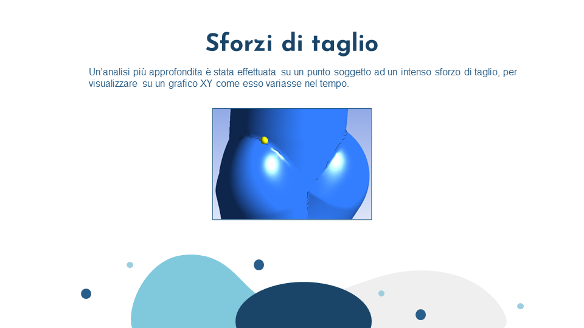
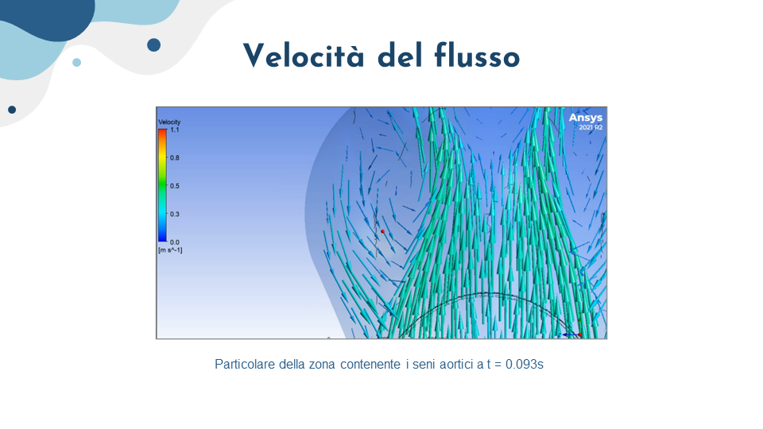
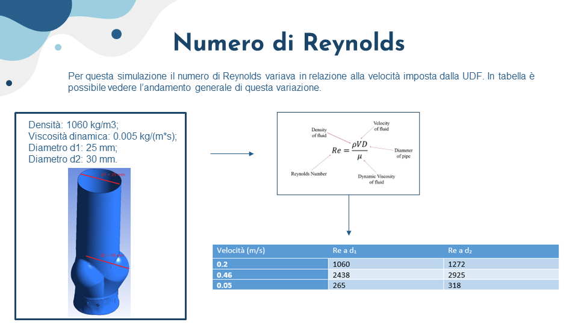
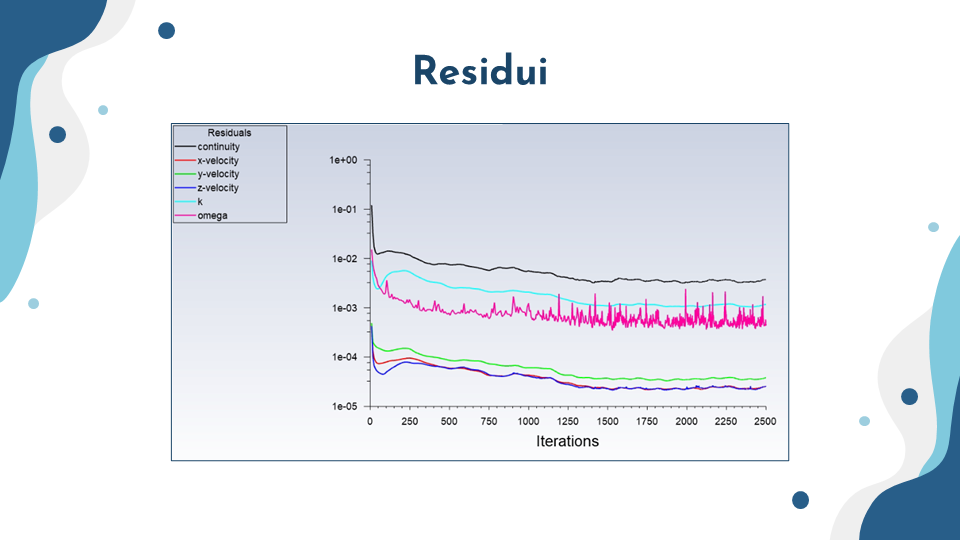

# Abstract
This project ha three main objectives:
 - Understand the flow dynamic subject to a mechanic valve
 - Identify the recirculation areas
 - Identify the most subject area to shear stress

To accomplish them, a CAD in Rhino and a mesh in Pointwise has been created. The analysis has been done on Ansys Fluent. 

# Technologies
- Rhino
- Pointwise
- Ansys Fluent

# Preview

# Project Overview

